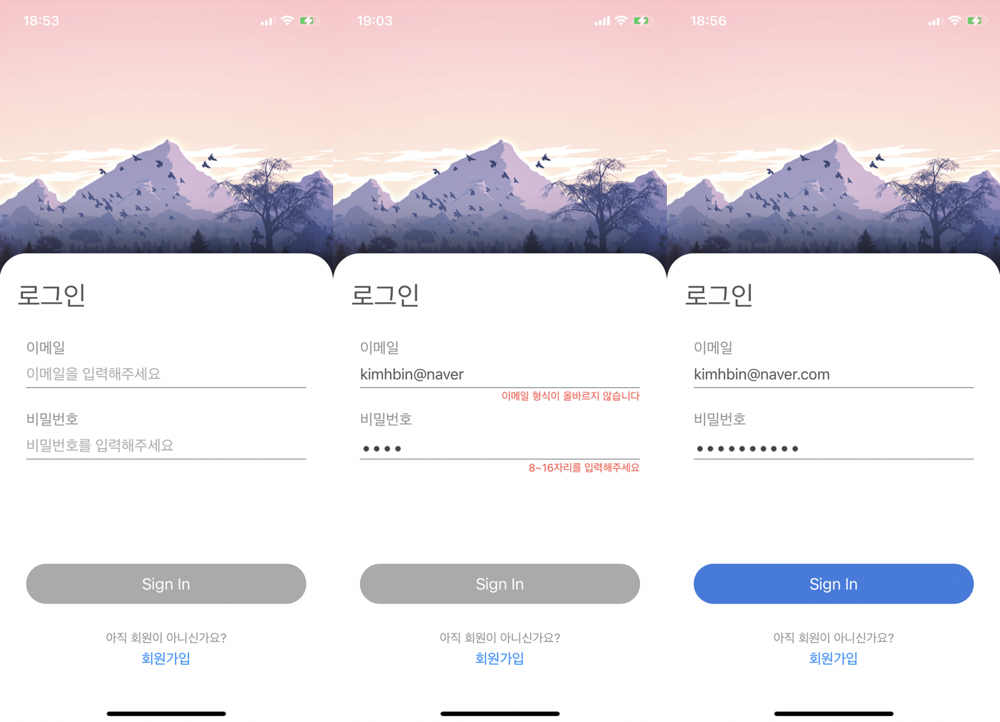
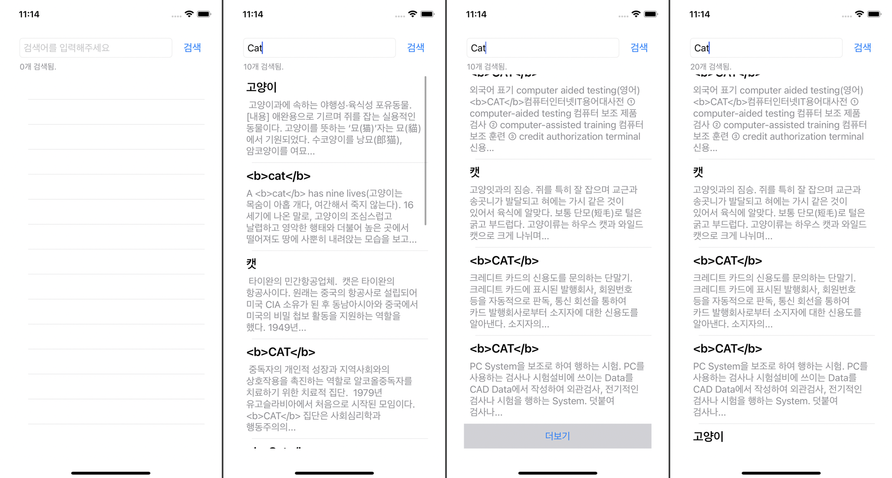
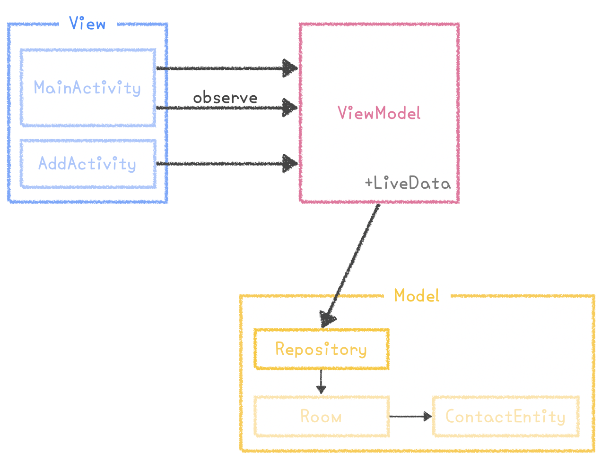
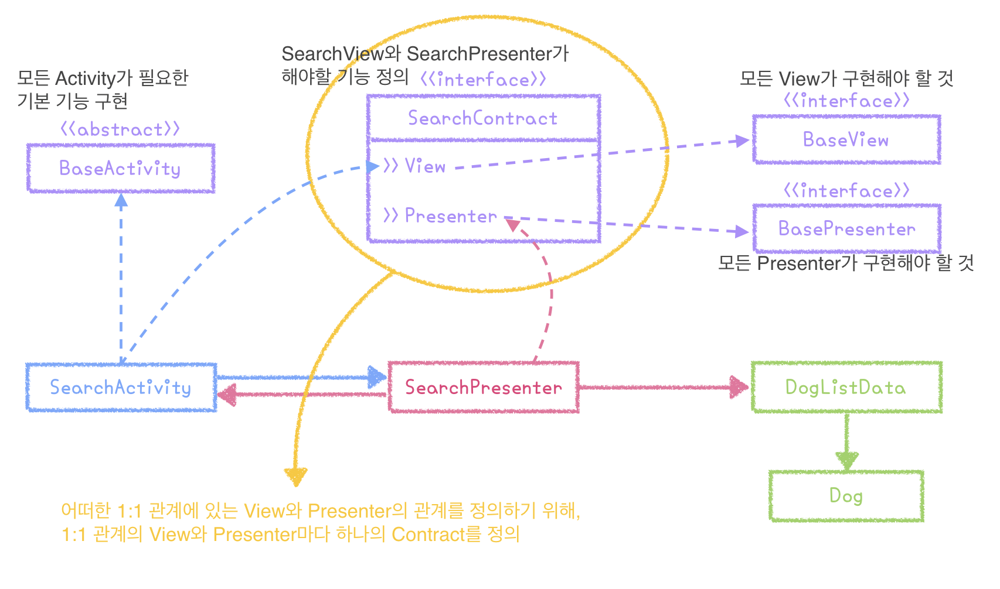

# Study_Architecture
iOS, Android의 다양한 기술을 활용하면서 MVVM, MVP, VIPER 등의 아키텍쳐를 활용? 공부? 연습? 해보기 위한 레포지토리.

<br />
<br />

## 🍎 (iOS) VIPER 패턴 예제 : SearchImage
* [네이버 이미지 검색 API](https://developers.naver.com/docs/search/image/) 활용
* `Alamofire`와 `CoreData` 사용
* VIPER의 이점
  + 재사용성과 테스트용이함을 위해 코드를 분리할 수 있다.
  + 그 역할에 맞춰 앱 컴포넌트를 분리할 수 있으며, 이것을 seperation of concern이라 부른다.
  + 새 기능을 추가하기 쉽다.
  + UI 로직이 비지니스 로직으로부터 떨어져있기 때문에 자연스럽게 테스트를 만들기 쉬워진다.
* 참고 : [VIPER-Architecture for iOS project with simple demo example.](https://medium.com/cr8resume/viper-architecture-for-ios-project-with-simple-demo-example-7a07321dbd29)
* 참고 : [Building iOS App With VIPER Architecture](https://afteracademy.com/blog/building-ios-app-with-viper-architecture-8109acc72227)

* 참고: [Zedd - Core Data](https://zeddios.tistory.com/987)

<br />
<br />

## 🍎 (iOS) MVVM 패턴 예제 : SignIn
* 간단한 로그인 화면 구현하기
* `RxSwift` 사용 - PublishSubject, PublishRelay
* 참고 : [Animating With The iOS Keyboard In Swift](https://www.robertpieta.com/animate-with-ios-keyboard-swift/)


<br />
<br />

## 🍎 (iOS) MVVM 패턴 예제 : Dictionary01
* 네이버 사전 API를 사용한 사전 검색 애플리케이션
* `Alamofire` 사용
* 안드로이드에서는 DataBinding을 그냥 설정만 해주면 데이터바인딩 사용이 가능 했는데, iOS의 경우 RxSwift/Combine을 사용하지 않는다면 Observable 객체를 직접 만들어 사용하거나 NotificationCenter을 사용해야 함을 알게되었다. 그래서 이번 예제에서는 직접 정의된 Observable 객체를 사용하였다.
<details>
<summary>Observable<T> 객체 (클릭하면 펼쳐집니다)</summary>
<div markdown="1">

```swift
final class Observable<T> {
  typealias Listener = (T) -> Void

  var listener: Listener?
  var value: T {
    didSet {
      listener?(value)
    }
  }

  init(_ value: T) {
    self.value = value
  }

  func bind(listener: Listener?) {
    self.listener = listener
    listener?(value)
  }
}
```

</div>
</details>

<br />



<br />
<br />

## 💫 (AOS) MVVM 패턴 예제 : Contacts01
* `LiveData`, `CoRoutine` 사용
* 연락처목록 만들기 애플리케이션


<br />
<br />

## 💫 (AOS) MVVM 패턴 예제 : Contracts03
* `DataBinding`, `LiveData`, `RxKotlin` 사용
* 블로그 정리 : [RecyclerView에 DataBinding 적용하기](https://beenii.tistory.com/103)
* 연락처 목록 만들기 애플리케이션
* RecyclerView에 데이터바인딩을 적용하기 위해 ViewHolder와 Adapter 변경
* 아직은 미숙해서 좀 더 고쳐야 할 것 같지만 그래도 Adapter와 ViewHolder에 데이터바인딩 적용 성공

<br />
<br />

## 💫 (AOS) MVP 패턴 예제 : DogList01
* 네트워크 작업을 임의로 Handler로 시간차를 두어 구현
* 각 Base 클래스들을 분리하여 추상화 과정 진행


```
(1) 사용자가 버튼을 누른다.
    -> View에서 클릭 이벤트가 발생
    -> View에서 발생한 클릭 이벤트를 Presenter로 전달
(2) Dog List를 가져온다. (DB에서든 API에서든. 여기서는 Handler로 흉내만 낼 거임)
    -> Presenter가 Model에게 데이터를 요청
    -> Model이 Presenter에 요청한 데이터를 전달
    -> Presenter가 받은 데이터를 가공
    -> 가공한 데이터를 View에 전달
(3) Dog List의 이름과 나이를 보이도록 한다.
    -> View가 Presenter에서 전달받은 데이터를 사용자에게 보인다.
```

<br />

---

<br />

## Others
* SwiftUI로 UI미리보기
```swift
#if DEBUG
import SwiftUI
struct ViewControllerRepresentabletable: UIViewControllerRepresentable {
    // update
    func updateUIViewController(_ uiViewController: UIViewControllerType, context: Context) {

    }

    // make UI
    @available(iOS 13.0, *)
    func makeUIViewController(context: Context) -> some UIViewController {
        ViewController()
    }
}

struct ViewController_Previews: PreviewProvider {
    static var previews: some View {
        ViewControllerRepresentabletable()
    }
}
#endif
```

<br />

---

<br />

## 🍎 참고 url (iOS)
* [간단한 예제로 살펴보는 iOS Design/Architecture Pattern: MVVM](https://lena-chamna.netlify.app/post/ios_design_pattern_mvvm/#%EA%B0%84%EB%8B%A8%ED%95%9C-MVVM-%EC%98%88%EC%A0%9C)
* [Data Binding in MVVM on iOS](https://medium.com/flawless-app-stories/data-binding-in-mvvm-on-ios-714eb15e3913)
* [MVVM with RxSwift](https://ios-development.tistory.com/140)
* [RxSwift + MVVM을 이용시에 사용 가능한 모습](https://mrgamza.tistory.com/509)

## 💫 참고 url (AOS)
* [AAC를 활용한 MVVM 적용 | 강남언니](https://blog.gangnamunni.com/post/aac_mvvm/)
* [안드로이드의 MVC, MVP, MVVM 종합 안내서](https://academy.realm.io/kr/posts/eric-maxwell-mvc-mvp-and-mvvm-on-android/)
* [AndroidKotlin MVVM & AAC 연습 예제](https://blog.yena.io/studynote/2019/03/27/Android-MVVM-AAC-2.html)
* [유튜브|RecyclerView and DataBinding](https://www.youtube.com/watch?v=Xklim5RGHz8)
* [MVP+Kotlin](https://medium.com/@dlgksah/mvp-kotlin-example-2de93add4c82)
