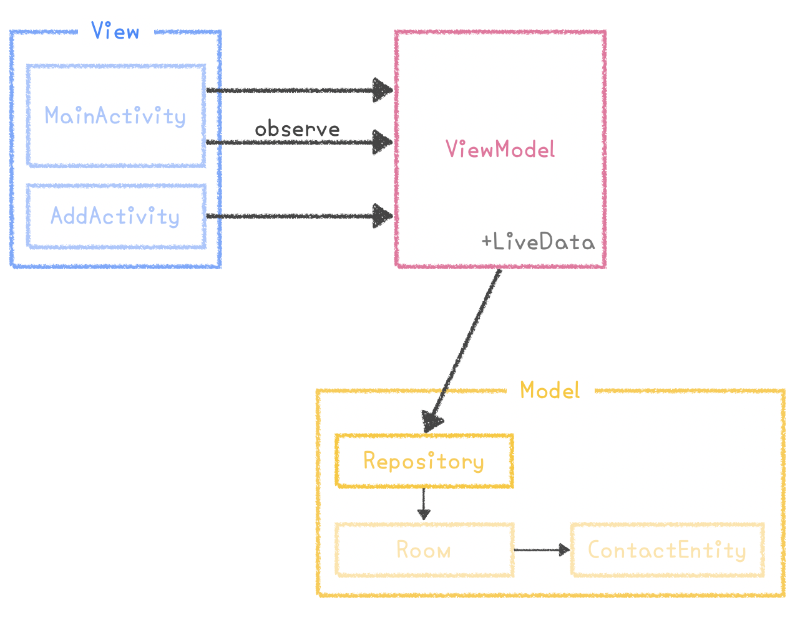

# Study_Archtecture
다양한 기술을 활용하면서 MVVM 패턴과 MVP 패턴을 활용? 공부? 연습? 해보기 위한 레포지토리.

## 참고 url
* [AAC를 활용한 MVVM 적용 | 강남언니](https://blog.gangnamunni.com/post/aac_mvvm/)
* [안드로이드의 MVC, MVP, MVVM 종합 안내서](https://academy.realm.io/kr/posts/eric-maxwell-mvc-mvp-and-mvvm-on-android/)
* [AndroidKotlin MVVM & AAC 연습 예제](https://blog.yena.io/studynote/2019/03/27/Android-MVVM-AAC-2.html)
* [유튜브|RecyclerView and DataBinding](https://www.youtube.com/watch?v=Xklim5RGHz8)

* [MVP+Kotlin](https://medium.com/@dlgksah/mvp-kotlin-example-2de93add4c82)

## 1. MVVM 패턴 예제 : Contacts01
* LiveData 사용
* CoRoutine 사용
* 연락처목록 만들기 애플리케이션

## 2. MVVM 패턴 예제 : Contracts03
* DataBinding 사용
* LiveData 사용
* CoRoutine 대신 RxKotlin 사용
* 블로그 정리 : [RecyclerView에 DataBinding 적용하기](https://beenii.tistory.com/103)
* 연락처 목록 만들기 애플리케이션
* RecyclerView에 데이터바인딩을 적용하기 위해 ViewHolder와 Adapter 변경
* 아직은 미숙해서 좀 더 고쳐야 할 것 같지만 그래도 Adapter와 ViewHolder에 데이터바인딩 적용 성공

## 3. MVP 패턴 예제 : DogList01
* 네트워크 작업을 임의로 Handler로 시간차를 두어 구현
* 각 Base 클래스들을 분리하여 추상화 과정 진행
