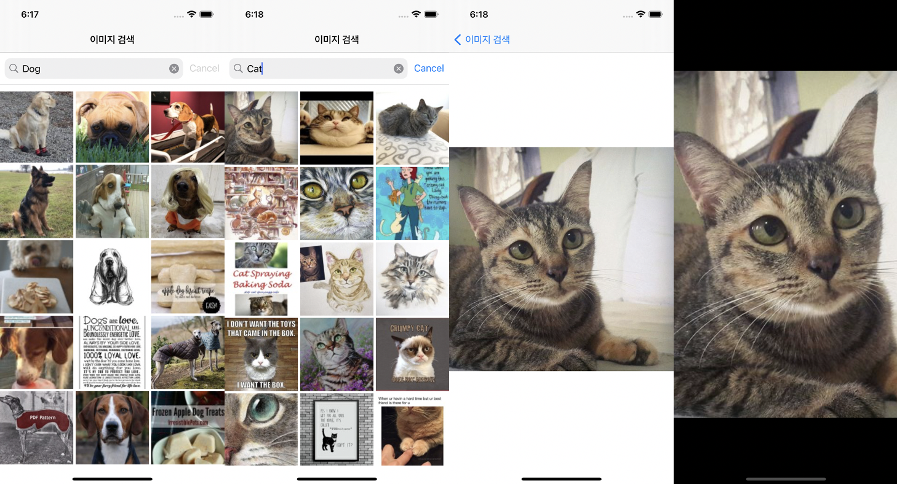
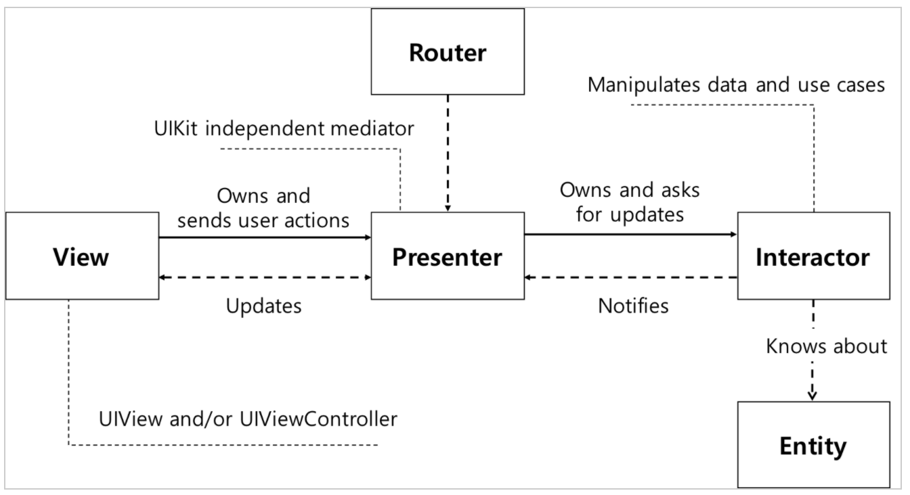
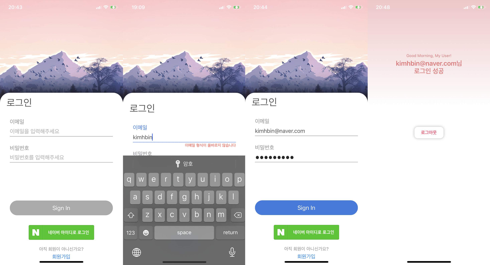

# Study Architecture
처음에는 Android로 다양한 아키텍쳐를 공부하다가, iOS 개발을 공부하기 시작하면서 iOS로 아키텍쳐 패턴을 연습 및 적용해보기 시작했습니다. iOS의 다양한 기술을 활용해보면서 MVVM, MVP, VIPER 등의 모바일 아키텍쳐 패턴을 공부하고 연습해보는 레포지토리입니다.

 

* MVVM
  + 재사용성과 테스트용이함을 위해 UI로직과 비즈니스로직을 분리할 수 있다.
  + View와 Model 간의 의존성이 없다.
  + View가 ViewModel을 관찰하고 ViewModel은 View에 대해 알지 못하기 때문에, View와 ViewModel 사이의 의존성도 거의 없어진다.
  + 하나의 ViewModel을 여러 View에서 사용할 수 있도록 할 수 있다.
* MVP
  + View와 Model을 분리한다.
  + View와 Presenter가 1:1 관계로 View와 Presenter 사이의 의존성이 깊어진다.
* VIPER
  + 재사용성과 테스트용이함을 위해 코드를 분리할 수 있다.
  + 그 역할에 맞춰 앱 컴포넌트를 분리할 수 있으며, 이것을 seperation of concern이라 부른다.
  + 새 기능을 추가하기 쉽다.
  + UI 로직이 비지니스 로직으로부터 떨어져있기 때문에 자연스럽게 테스트를 만들기 쉬워진다.
  + 다만, 한 화면을 구성하는 파일이 너무 많아져서 화면이 많아질수록 코드의 양도 방대해진다.

<br />

## LIST
* [🍎 iOS-VIPER 패턴 예제-SearchImage](#iOS-VIPER-SearchImage)
* [🍎 iOS-MVVM 패턴 예제-SignIn](#iOS-MVVM-SignIn)
* [🍎 iOS-MVVM 패턴 예제-Dictionary01](#iOS-MVVM-Dictionary01)
* [💫 AOS-MVVM 패턴 예제-Contacts01](#AOS-MVVM-Contacts01)
* [💫 AOS-MVVM 패턴 예제-Contracts03](#AOS-MVVM-Contracts03)
* [💫 AOS-MVP 패턴 예제-DogList01](#AOS-MVP-DogList01)
* [Ohters](#Others)

<br />
<br />

## iOS-VIPER-SearchImage
* [네이버 이미지 검색 API](https://developers.naver.com/docs/search/image/) 활용
* `Alamofire`와 `CoreData` 사용
* 참고 URL
  + [VIPER-Architecture for iOS project with simple demo example.](https://medium.com/cr8resume/viper-architecture-for-ios-project-with-simple-demo-example-7a07321dbd29)
  + [Building iOS App With VIPER Architecture](https://afteracademy.com/blog/building-ios-app-with-viper-architecture-8109acc72227)
  + [Zeddios - Core Data](https://zeddios.tistory.com/987)

<details>
<summary>ScreenShot (클릭하면 펼쳐집니다)</summary>
<div markdown="1">



</div>
</details>



<br />
<br />

## iOS-MVVM-SignIn
* 간단한 로그인 화면 구현하기
* 이메일과 비밀번호 양식이 올바른 상태에서만 버튼이 활성화되도록 구현
* `네이버 로그인 API` 사용 - 로그인 후 token 가져오기
* `Alamofire`, `RxSwift` 사용 - PublishSubject, PublishRelay
* 참고 : [Animating With The iOS Keyboard In Swift](https://www.robertpieta.com/animate-with-ios-keyboard-swift/)


<br />
<br />

## iOS-MVVM-Dictionary01
* 네이버 사전 API를 사용한 사전 검색 애플리케이션
* `Alamofire` 사용
* 안드로이드에서는 DataBinding을 그냥 설정만 해주면 데이터바인딩 사용이 가능 했는데, iOS의 경우 RxSwift/Combine을 사용하지 않는다면 Observable 객체를 직접 만들어 사용하거나 NotificationCenter을 사용해야 함을 알게되었다. 그래서 이번 예제에서는 직접 정의된 Observable 객체를 만들어 사용해보았다.
* 블로그: [Data Binding in MVVM on iOS](https://beenii.tistory.com/124?category=787971) 
<details>
<summary>Observable<T> 객체 (클릭하면 펼쳐집니다)</summary>
<div markdown="1">

```swift
final class Observable<T> {
  typealias Listener = (T) -> Void

  var listener: Listener?
  var value: T {
    didSet {
      listener?(value)
    }
  }

  init(_ value: T) {
    self.value = value
  }

  func bind(listener: Listener?) {
    self.listener = listener
    listener?(value)
  }
}
```

</div>
</details>

<br />


<br />
<br />

## AOS-MVVM-Contacts01
* 간단하게 이름, 전화번호를 추가하거나 목록을 보여주는 애플리케이션
* `LiveData`, `CoRoutine` 사용


<br />
<br />

## AOS-MVVM-Contracts03
* 간단하게 이름, 전화번호를 추가하거나 목록을 보여주는 애플리케이션
* RecyclerView에 데이터바인딩을 적용하기 위해 **Contacts01**에서 ViewHolder와 Adapter 변경
* `DataBinding`, `LiveData`, `RxKotlin` 사용
* 블로그: [RecyclerView에 DataBinding 적용하기](https://beenii.tistory.com/103)
* 아직은 미숙해서 좀 더 고쳐야 할 것 같지만.. 그래도 Adapter와 ViewHolder에 데이터바인딩 적용 성공

<br />
<br />

## AOS-MVP-DogList01
* 네트워크 작업을 임의로 Handler로 시간차를 두어 구현
* 각 Base 클래스들을 분리하여 추상화 과정 진행


```
(1) 사용자가 버튼을 누른다.
    -> View에서 클릭 이벤트가 발생
    -> View에서 발생한 클릭 이벤트를 Presenter로 전달
(2) Dog List를 가져온다. (DB에서든 API에서든. 여기서는 Handler로 흉내만 낼 거임)
    -> Presenter가 Model에게 데이터를 요청
    -> Model이 Presenter에 요청한 데이터를 전달
    -> Presenter가 받은 데이터를 가공
    -> 가공한 데이터를 View에 전달
(3) Dog List의 이름과 나이를 보이도록 한다.
    -> View가 Presenter에서 전달받은 데이터를 사용자에게 보인다.
```

<br />

---

<br />

## Others
* SwiftUI로 UI미리보기
```swift
#if DEBUG
import SwiftUI
struct ViewControllerRepresentabletable: UIViewControllerRepresentable {
    // update
    func updateUIViewController(_ uiViewController: UIViewControllerType, context: Context) {

    }

    // make UI
    @available(iOS 13.0, *)
    func makeUIViewController(context: Context) -> some UIViewController {
        ViewController()
    }
}

struct ViewController_Previews: PreviewProvider {
    static var previews: some View {
        ViewControllerRepresentabletable()
    }
}
#endif
```

<br />

---

<br />

## 🍎 참고 url (iOS)
* [간단한 예제로 살펴보는 iOS Design/Architecture Pattern: MVVM](https://lena-chamna.netlify.app/post/ios_design_pattern_mvvm/#%EA%B0%84%EB%8B%A8%ED%95%9C-MVVM-%EC%98%88%EC%A0%9C)
* [Data Binding in MVVM on iOS](https://medium.com/flawless-app-stories/data-binding-in-mvvm-on-ios-714eb15e3913)
* [MVVM with RxSwift](https://ios-development.tistory.com/140)
* [RxSwift + MVVM을 이용시에 사용 가능한 모습](https://mrgamza.tistory.com/509)

## 💫 참고 url (AOS)
* [AAC를 활용한 MVVM 적용 | 강남언니](https://blog.gangnamunni.com/post/aac_mvvm/)
* [안드로이드의 MVC, MVP, MVVM 종합 안내서](https://academy.realm.io/kr/posts/eric-maxwell-mvc-mvp-and-mvvm-on-android/)
* [AndroidKotlin MVVM & AAC 연습 예제](https://blog.yena.io/studynote/2019/03/27/Android-MVVM-AAC-2.html)
* [유튜브|RecyclerView and DataBinding](https://www.youtube.com/watch?v=Xklim5RGHz8)
* [MVP+Kotlin](https://medium.com/@dlgksah/mvp-kotlin-example-2de93add4c82)
